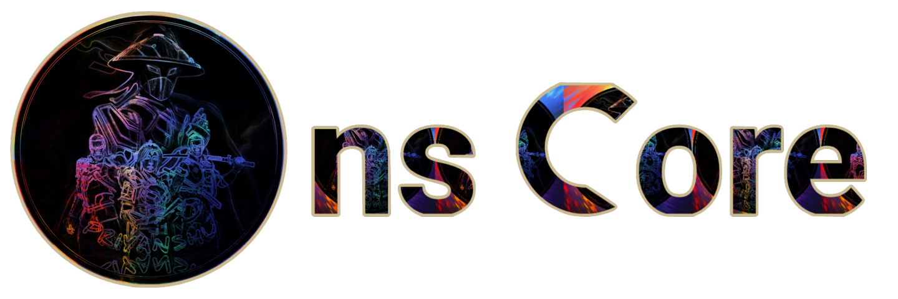

<div align="center">

# nsCore




[](https://discord.gg/7SAcEv7MDd)
[](https://github.com/nsgpriyanshu/nscore/graphs/contributors)

[](https://github.com/nsgpriyanshu/nscore/actions/workflows/docs-deployment.yml)
[](https://github.com/nsgpriyanshu/nscore)
[](https://github.com/nsgpriyanshu/nscore/actions/workflows/codeql.yml)
[](https://github.com/nsgpriyanshu/nscore/actions/workflows/dependency-review.yml)
[](https://github.com/nsgpriyanshu/nscore/actions/workflows/dependabot/dependabot-updates)

</div>

## About

nsCore is the official app of the nsLaboratory server, an informative Discord app specially created for Creator's World and the nsLaboratory server! This is also the base model for all the products in nsLaboratory, and it's open source, so anyone can use it for their creative Discord apps too.

## Invite

> [!NOTE]
> nsCore is our personal bot, so we can't permit it for public use. However, we have a public bot with the same features called Power Op, a cute, user-friendly, powerful Discord app based on nsCore. Please add our Power Op bot to your server and experience the essence of nsCore! Thank you.
>
> Here is the invite link for our Power Op bot: [Invite Now](https://discord.com/oauth2/authorize?client_id=943458326644150323)

## Features

- Built-in information commands
- Supports both Discord message and interaction (slash) commands
- Advanced command, event, and error handler
- Built-in Dev-only command option with developer commands (message only)
- Comes with tests by jest

## How to Use (User)

1. Join the [Creator's Worlds](https://discord.gg/4szUHfvZ4g) Discord server.
2. Start your command journey by typing `ns.help` to view the full list of commands.
3. Access interaction commands through slash commands by typing `/` and selecting from the available options.
4. For detailed guidance, refer to the [docs](https://nsgpriyanshu.github.io/nscore)

## How to Use (Developer)

To use nsCore as your base model, follow these steps:

1. Clone this repo:

   ```sh
   git clone https://github.com/nsgpriyanshu/nscore.git
   ```

2. Set up your `.env` file with the necessary environment variables:

   ```sh
   AUTH_TOKEN=YOUR-DISCORD-BOT-TOKEN
   CLIENT_ID=YOUR-DISCORD-BOT-ID
   DEVELOPER_IDS=YOUR-DISCORD-ID
   SERVER_ID=YOUR-DEV-SERVER-ID
   ERROR_CHANNEL_ID=YOUR-ERROR-CHANNEL-ID
   ```

3. Install the dependencies:

   ```sh
   npm install
   ```

4. Run the bot:

   ```sh
   npm run start
   ```

5. Deploy the commands:

   ```sh
   npm run deploy
   ```

For full details, check out our [docs](https://nsgpriyanshu.github.io/nsdocs).

## Technology Used

- [TypeScript](https://www.typescriptlang.org/) for enhanced type safety and maintainability
- [Discord.js](https://discord.js.org/) the most powerful and popular Discord library
- [Nextra](https://nextra.site/) simple, powerful and flexible site generation framework
  with everything you love from Next.js

## Links

We have separate documentation tailored for both users and developers:

- [Docs](https://nsgpriyanshu.github.io/nscore) - Designed for users, this documentation contains all the commands and features you need to get started and effectively use the bot.
- [nsDocs](https://nsgpriyanshu.github.io/nsdocs) - Designed for developers, this documentation provides detailed information on setup, customization, and advanced usage.

## References:

- [Discord.js Guide](https://discordjs.guide/#before-you-begin) - The official Discord.js guide, aimed at users who are either unfamiliar or inexperienced with Node.js and creating Discord bots. It assumes you have a basic understanding of JavaScript.
- [TypeScript Handbook](https://www.typescriptlang.org/docs/handbook/intro.html) - The TypeScript Handbook is the official documentation of TypeScript. If you are not familiar with TypeScript basics, you can visit this handbook to get started.

## Support

If you need assistance with understanding the documentation, encounter any issues, or simply require guidance, please join our [Discord server](https://discord.gg/vRXgWaar2G). Our community and support team are here to help you!

## Contributors


[](https://nsgpriyanshu.github.io)
