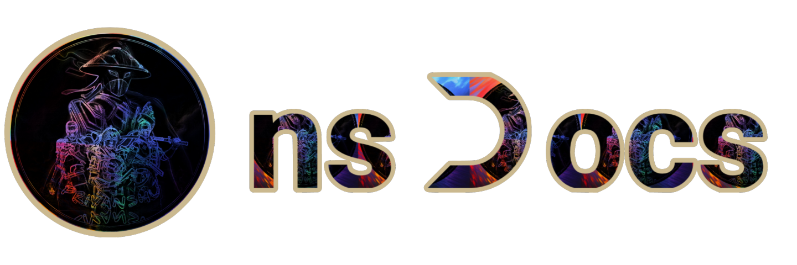

<div align="center">

# nsDocs




</div>

## About

This is the official documentation of the ns Core app (bot). It also serves as the official documentation of Power Op app (bot).

## Technology Used

- [Next.js](https://nextjs.org/) Next.js is a React framework that enables several powerful features, including server-side rendering and static site generation.
- [Nextra](https://nextra.vercel.app/) Nextra is a Next.js-based static site generator that makes it easy to create and manage documentation websites.

## How to Use (Developer)

### Basic Installation of Next.js with TypeScript

1. **Install Node.js**: Make sure you have Node.js installed on your machine. You can download it from [nodejs.org](https://nodejs.org/).

2. **Create a New Next.js Project with TypeScript**: Use the following command to create a new Next.js project with TypeScript.

   ```bash
   npx create-next-app@latest --typescript
   ```

   Follow the prompts to set up your new project.

3. **Navigate to Your Project Directory**:

   ```bash
   cd your-project-name
   ```

4. **Start the Development Server**:

   ```bash
   npm run dev
   ```

   Open [http://localhost:3000](http://localhost:3000) with your browser to see your new Next.js application.

5. **Install Nextra**: If you're using Nextra for documentation, you can install it by running:

   ```bash
   npm install nextra nextra-theme-docs
   ```

   Then, update your `next.config.js` to use the Nextra theme.

6. **Configure Nextra**: Create or update a `theme.config.ts` file to configure Nextra.

   ```tsx
   import { DocsThemeConfig } from 'nextra-theme-docs'

   const config: DocsThemeConfig = {
     logo: <span>Docs</span>,
     project: {
       link: 'https://github.com/yourusername/yourbot-docs',
     },
     // other configurations
   }

   export default config
   ```

7. **Update next.config.js**: Configure Next.js to use the Nextra theme.

   ```js
   const withNextra = require('nextra')({
     theme: 'nextra-theme-docs',
     themeConfig: './theme.config.ts',
   })

   module.exports = withNextra()
   ```

8. **Start Developing Your Documentation**: You can start adding documentation pages in the `pages` directory.

For more detailed guides and information, refer to the official documentation of [Next.js](https://nextjs.org/docs) and [Nextra](https://nextra.vercel.app/docs).
