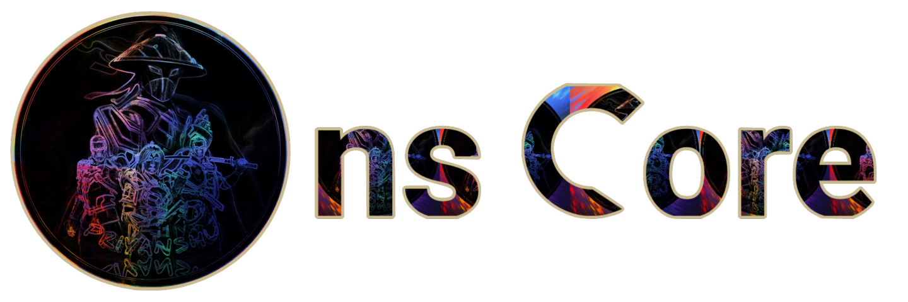

<div align="center">

# nsDocs




</div>

## About

This is the official documentation of the ns Core app (bot). It also serves as the official documentation of Power Op app (bot).

## Technology Used

- [Next.js](https://nextjs.org/) Next.js is a React framework that enables several powerful features, including server-side rendering and static site generation.

## How to Use (Developer)

### Basic Installation of Next.js with TypeScript

1.  **Install Node.js**: Make sure you have Node.js installed on your machine. You can download it from [nodejs.org](https://nodejs.org/).

2.  **Create a New Next.js Project with TypeScript**: Use the following command to create a new Next.js project with TypeScript.

    ```bash
    npx create-next-app@latest --typescript
    ```

    Follow the prompts to set up your new project.

3.  **Navigate to Your Project Directory**:

    ```bash
    cd your-project-name
    ```

4.  **Start the Development Server**:

    ```bash
    npm run dev
    ```

    Open [http://localhost:3000](http://localhost:3000) with your browser to see your new Next.js application.

5.  **Start Developing Your Documentation**: You can start adding documentation pages using Next.js.

For more detailed guides and information, refer to the official documentation of [Next.js](https://nextjs.org/docs)
